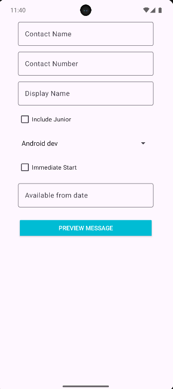
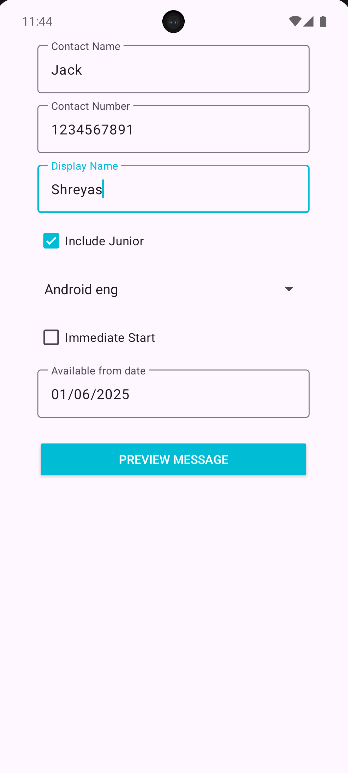
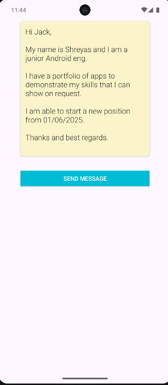

# SelfPromoApp

SelfPromoApp is a simple Android application that helps you quickly generate a professional self-introduction message and send it via SMS.  
It’s designed for students, job seekers, or anyone who wants to share their portfolio and availability in a polished way.

---

## ✨ Features

- 📋 Collects your details (name, contact, job title, start date, etc.)
- 🧑‍💻 Option to mark yourself as a **junior** applicant
- 📅 Choose between **immediate start** or a custom start date
- 📜 Previews a formatted professional message
- 📩 Sends the message directly via the SMS app

---

## 🏗️ Tech Stack

- **Language:** Kotlin  
- **Framework:** Android SDK  
- **UI:** Material Components for Android  
- **Data Passing:** Serializable (Message object between Activities)

---

## 📂 Project Structure
````

com.project.selfpromoapp
├── MainActivity.kt       # Collects user inputs
├── PreviewActivity.kt    # Previews and sends the generated message
├── Message.kt            # Data class holding user information
└── res/layout            # Layout XML files

````

---

## 🚀 How to Run

1. Clone this repository  
   ```bash
   git clone https://github.com/Notshreyasrbhat/SelfPromoApp

2. Open the project in **Android Studio**
3. Build and run on an emulator or a physical device
4. Fill in your details → Preview message → Send via SMS ✅

---

## 📸 Screenshots
<table>
  <tr>
    <th>Homescreen</th>
    <th>Details</th>
    <th>Preview</th>
  </tr>
  <tr>
    <td></td>
    <td></td>
    <td></td>
  </tr>
</table>

---

## ⚡ Future Improvements

* Replace `Serializable` with `Parcelable` for better performance
* Add **email sharing option** alongside SMS
* Dark mode support 🌙
* Save frequently used profiles

---

## 📜 License

This project is licensed under the [MIT License](LICENSE).
You’re free to use, modify, and distribute it.

---

## 🙌 Acknowledgments

* Built with [Android Studio](https://developer.android.com/studio)
* Uses [Material Design Components](https://m3.material.io/)


